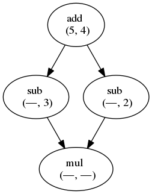

.. highlight:: python
    :linenothreshold: 5

Eating noodles (user docs)
==========================

The primary goal of the *noodles* library is to ease the construction and execution of *computational workflows* using the Python language. This library is meant for scientists who want to perform complex compute-intensive tasks on parallel/distributed infrastructures in a readable, scalable and sustainable/reproducible? manner.
A workflow is commonly modelled as a *directed acyclic graph* (DAG or simply graph) in which the computations are represented as nodes whereas the dependencies between them are represented as directed edges (indicating data transport).

A first example
---------------

Let's look at a small example of creating a diamond workflow, which consists of simple (arithmetic) functions:

::

    from noodles import run_single
    from noodles.tutorial import (add, sub, mul)

    u = add(5, 4)
    v = sub(u, 3)
    w = sub(u, 2)
    x = mul(v, w)

    answer = run_single(x)

    print("The answer is {0}.".format(answer))

That allmost looks like normal Python! The only difference is the :py:func:`~noodles.run_single` statement at the end of this program.
The catch is that none of the computation is actually done until the :py:func:`~noodles.run_single` statement has been given.
The variables ``u``, ``v``, ``w``, and ``x`` only represent the *promise* of a value.
The functions that we imported are wrapped, such that they construct the directed acyclic graph of the computation in stead of just computing the result immediately.
This DAG then looks like this:

    The diamond workflow.

Running this program will first evaluate the result to ``add(5, 4)``.
The resulting value is then inserted into the empty slots in the depending nodes.
Each time a node has no empty slots left, it is scheduled for evaluation.
At the end, the program should print:

::

    The answer is 42.

At this point it is good to know what the module ``noodles.tutorial`` looks like.
It looks very simple.
However, you should be aware of what happens behind the curtains, to understand the limitations of this approach.

::

    from noodles import schedule

    @schedule
    def add(a, b):
      """Adding up numbers! (is very uplifting)"""
      return a + b

    @schedule
    def sub(a, b):
      """Subtracting numbers."""
      return a - b

    @schedule
    def mul(a, b):
      """Multiplying numbers."""
      return a * b

    ...

The :py:func:`@schedule <noodles.schedule>` decorators takes care that the functions actually return *promises* instead of values.
Such a :py:class:`~noodles.interface.PromisedObject` is a placeholder for the expected result.
It stores the workflow graph that is needed to compute the promise.
When another :py:func:`schedule <noodles.schedule>`-decorated function is called with a promise, the graphs of the dependencies are merged to create a new workflow graph.

.. NOTE:: The promised object can be of any type and can be used as a normal object.
          You access attributes and functions of the object that is promised as you normally would.
          Be aware, however, that it is important to program in a functional way, so changing the attributes of a promised object is not a good idea.
          Instead, return a copy of the object with the changed values.

Doing things parallel
~~~~~~~~~~~~~~~~~~~~~

Using the Noodles approach it becomes very easy to paralellise computations. Let's look at a second example.

::

    from noodles import (gather, run_parallel)
    from noodles.tutorial import (add, sub, mul, accumulate)

    def my_func(a, b, c):
        d = add(a, b)
        return mul(d, c)

    u = add(1, 1)
    v = sub(3, u)
    w = [my_func(i, v, u) for i in range(6)]
    x = accumulate(gather(*w))

    answer = run_parallel(x, n_threads=4)

    print("The answer is {0}, again.".format(answer))

This time the workflow graph will look a bit more complicated.

.. figure:: _static/images/dag2.png
    :alt: the workflow graph of the second example
    :align: center
    :figwidth: 100%

    The workflow graph of the second example.

Here we see how a user can define normal python functions and use them to build a larger workflow.
Furthermore, we introduce a new bit of magic: the :py:func:`gather <noodles.gather>` function.
When you build a list of computations using a list-comprehension like above, you essentially store a *list of promises* in variable ``w``.
However, schedule-decorated functions cannot easily see which arguments contain promised values, such as ``w``, and which arguments are plain Python.
The :py:func:`gather <noodles.gather>` function converts the list of promises into a promise of a list, making it clear to the scheduled function this argument is a promise.
The :py:func:`gather <noodles.gather>` function is defined as follows:

::

    @schedule
    def gather(*lst):
        return lst

By unpacking the list (by doing ``gather(*w)``) in the call to gather, each item in ``w`` becomes a dependency of the ``gather`` node in this workflow, as we can see in the figure above.

To make use of the parallelism in this workflow, we run it with :py:func:`~noodles.run_parallel`.
This runner function creates a specified number of threads, each taking jobs from the Noodles scheduler and returning results.

Running workflows
-----------------

Noodles ships with a few ready-made functions that run the workflow for you, depending on the amount of work that needs to be done.

:py:func:`~noodles.run_single`, local single thread
~~~~~~~~~~~~~~~~~~~~~~~~~~~~~~~~~~~~~~~~~~~~~~~~~~~
Runs your workflow in the same thread as the caller.
This function is mainly for testing.
When running workflows you almost always want to use one of the other functions.

:py:func:`~noodles.run_parallel`, local multi-thread
~~~~~~~~~~~~~~~~~~~~~~~~~~~~~~~~~~~~~~~~~~~~~~~~~~~~
Runs your workflow in parallel using any number of threads.
Usually, specifying the number of cores in your CPU will give optimal performance for this runner.

.. NOTE:: If you are very **very** certain that your workflow will never need to scale to cluster-computing, this runner is more lenient on the kinds of Python that is supported, because function arguments are not converted to and from JSON. Think of nested functions, lambda forms, generators, etc.

:py:func:`~noodles.run_process`, local multi-process
~~~~~~~~~~~~~~~~~~~~~~~~~~~~~~~~~~~~~~~~~~~~~~~~~~~~
Starts a second process to run jobs. This is usefull for testing the JSON compatability of your workflow on your own machine.

Xenon
~~~~~
Xenon_ is a Java library offering a uniform interface to all manners of job schedulers. Running a job on your local machine is as easy as submitting it to SLURM or Torque on your groceries supercomputer. To talk to Xenon from Python we use pyxenon_.

Using the Xenon runner, there are two modes of operation: *batch* and *online*. In online mode, jobs are streamed to the worker and results read back. If your laptop crashes while an online computation is running, that is to say, the connection is broken, the worker dies and you may lose results. Getting the online mode to be more robust is one of the aims for upcomming releases.

The Xenon runner needs a way to setup the virtualenv on the remote side, so a worker script needs to be specified. We have included a bash-script ``worker.sh`` that should work in the simplest cases.

.. code-block:: bash

    #!/bin/bash

    # run in the directory where the script is located
    cd "$(dirname "${BASH_SOURCE[0]}")"

    # activate the virtualenv that is given as first argument
    # invoking this script.
    if [ -e $1/bin/activate ]; then
    	source $1/bin/activate;
    fi

    # start the worker with the rest of the arguments.
    # stderr is written to a file.
    python -m noodles.worker ${@:2} 2> errlog

    # close the virtualenv.
    if [ -z ${VIRTUAL_ENV+x} ]; then
    	deactivate;
    fi

If you need to setup some more aspects of the environment, load modules, set variables etc., modify this script and put it in the directory where you want to run the jobs. Specify this directory in the Python script.

::

    from noodles import (
        serial, gather)
    from noodles.run.xenon import (
        XenonConfig, RemoteJobConfig, XenonKeeper, run_xenon_prov)
    from noodles.display import (
        NCDisplay)

    from noodles.tutorial import add, accumulate

    if __name__ == "__main__":
        a = [add(i, j) for i in range(5) for j in range(5)]
        b = accumulate(gather(*a))

        # XenonKeeper is the root Xenon object that gives access 
        # to the Xenon Java library
        with XenonKeeper() as Xe:
            # We recommend loging in on your compute resource 
            # through private/public key pairs. This prevents 
            # passwords ending up as ASCII in your source files.
            certificate = Xe.credentials.newCertificateCredential(
                'ssh', os.environ['HOME'] + '/.ssh/id_rsa', '<username>', '', None)

            # Configure Xenon to access your favourite super computer.
            xenon_config = XenonConfig(
                jobs_scheme='slurm',
                location='login.super-duper-computer.darpa.net',
                credential=certificate
            )

            # Specify how to submit jobs.
            job_config = RemoteJobConfig(
                registry=serial.base,
                prefix='<path-to-virtualenv>',
                working_dir='<project-path>',
                time_out=5000
            )

            # Run jobs with NCurses based console feedback
            with NCDisplay() as display:
                result = run_xenon_prov(
                    b, Xe, "cache.json", 2, xenon_config, job_config,
                    display=display)

        print("This test is working {0}%!".format(result))

Hybrid mode
~~~~~~~~~~~
We may have a situation where a workflow consists of some very heavy *compute* jobs and a lot of smaller jobs that do some bookkeeping. If we were to schedule all the menial jobs to a SLURM queue we actually slow down the computation through the overhead of job submission. The Noodles cook may provide the schedule functions with hints on the type of job the function represents. Depending on these hints we may dispatch the job to a remote worker or keep it on the local machine.

We provide an example on how to use the hybrid worker in the source.

If you really need to, it is not too complicated to develop your own job runner based on some of these examples. Elsewhere in this documentation we elaborate on the architecture and interaction between runners and the scheduler, see: :ref:`noodles-scheduler`.

.. _Xenon: http://nlesc.github.io/Xenon/
.. _pyxenon: http://github.com/NLeSC/pyxenon
